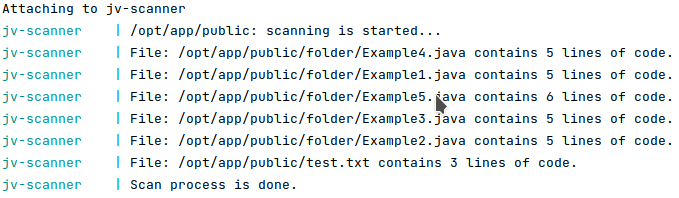

# PRESENTATION

## As result of scanner's work you get results of process:

**Directory test/public/folder contains test files from test task.**

---

# DEPLOY

## Steps:
### 0. You need docker on your host machine;
### 1. git clone https://github.com/gettads/code-scanner.git
### 2. RUN inside the directory `make scan [parameters]`
 - if you launch the command without parameters, scanner will run
in test mode: will be used files from test/public directory.;
 - parameter `dir`. If you launch this command like `make scan dir=.test/path/to/dir`,
scanner will process recursively all files in your custom directory.